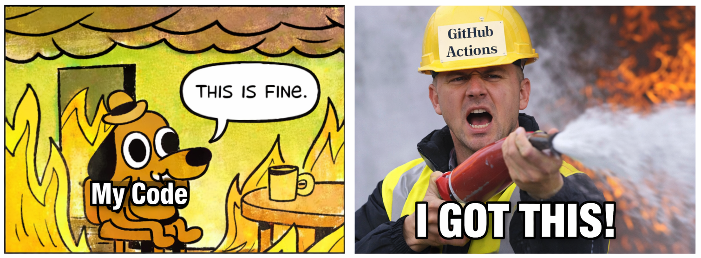
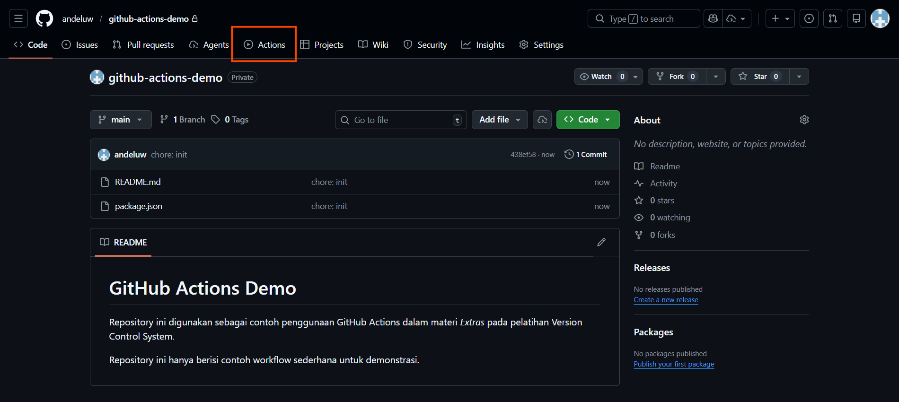
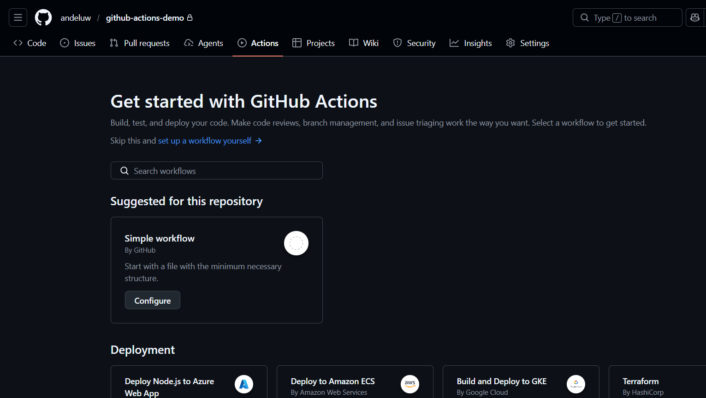
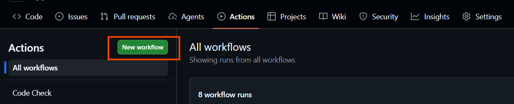
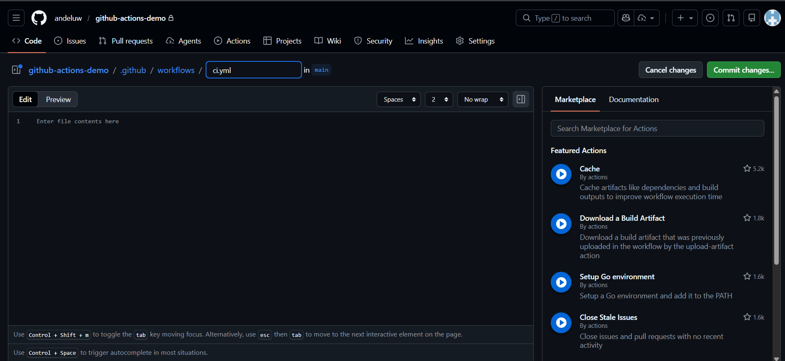
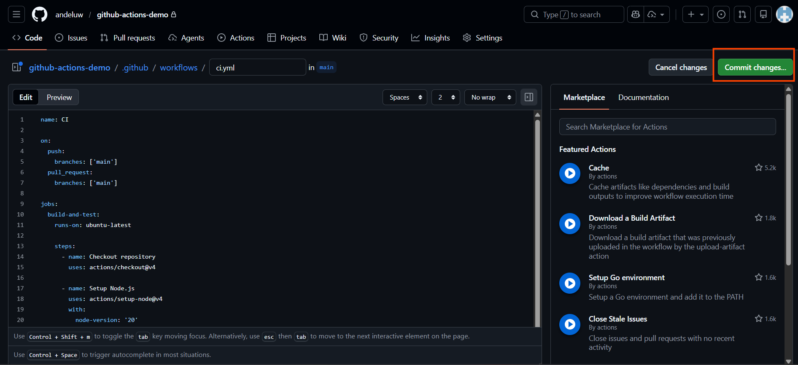
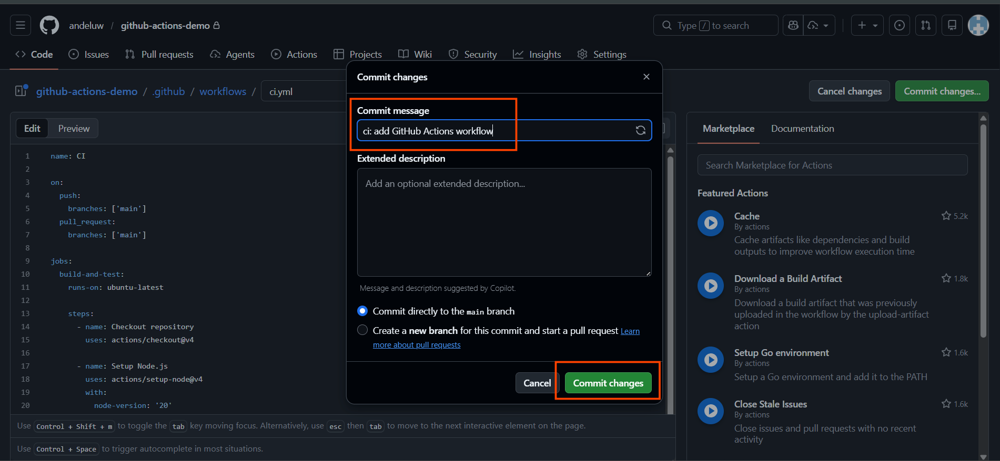
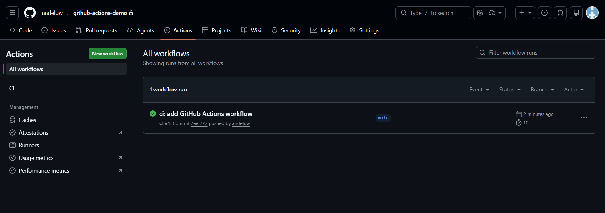
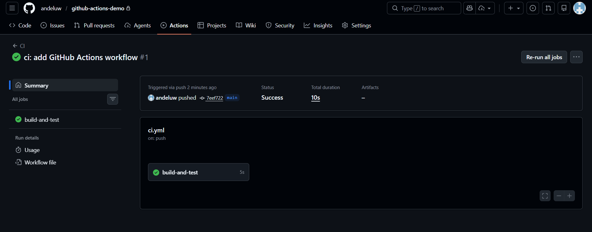

# GitHub Actions



Untuk mengurangi pekerjaan berulang dalam pengembangan perangkat lunak, seperti
menjalankan test, memastikan aplikasi dapat di-build, atau melakukan pengecekan
setiap ada perubahan kode, dibutuhkan proses yang lebih terstruktur dan otomatis.

Dalam praktiknya, proses-proses tersebut sering dilakukan secara manual oleh developer.
Jika dilakukan terus-menerus, hal ini dapat memakan waktu dan berpotensi terlewat,
yang pada akhirnya dapat memengaruhi kualitas proyek.

Oleh karena itu, GitHub menyediakan sebuah fitur bernama **GitHub Actions** yang
memungkinkan kita menjalankan berbagai proses otomatis langsung dari repository.

## Apa itu GitHub Actions?

GitHub Actions adalah fitur pada GitHub yang memungkinkan kita menjalankan workflow
otomatis berdasarkan event tertentu pada repository, seperti push, pull request,
atau aksi lainnya.

GitHub Actions tidak hanya digunakan untuk **Continuous Integration (CI)**, tetapi juga
dapat digunakan untuk berbagai kebutuhan otomasi, seperti:

- Menjalankan test dan build secara otomatis
- Melakukan pengecekan kualitas kode
- Membantu proses deployment
- Menjalankan otomasi sederhana untuk workflow tim

Pada modul ini, GitHub Actions diperkenalkan sebagai **alat otomasi** pada GitHub,
dengan **contoh penggunaan pada skenario Continuous Integration (CI)**.

## Kenapa GitHub Actions?

Alasan utama menggunakan GitHub Actions adalah karena GitHub Actions terintegrasi
langsung dengan repository GitHub. Dengan demikian, kita dapat menjalankan otomasi
tanpa perlu menyiapkan server atau layanan tambahan.

GitHub Actions cocok digunakan untuk proyek berskala kecil hingga menengah, serta
sangat membantu untuk menjaga konsistensi workflow dalam tim pengembangan.

## Cara Kerja GitHub Actions

GitHub Actions bekerja menggunakan file workflow berbasis _YAML_ yang disimpan pada
folder berikut:

```
.github/workflows/
```

File workflow ini berisi:

- Event pemicu (trigger)
- Environment yang digunakan
- Langkah-langkah (steps) yang akan dijalankan

## Contoh Penggunaan: Continuous Integration (CI)

Salah satu penggunaan GitHub Actions yang paling umum adalah untuk **Continuous
Integration (CI)**. CI bertujuan untuk memastikan bahwa kode tetap dapat dijalankan
dan tidak rusak setiap kali ada perubahan.

Pada contoh ini, workflow CI akan dijalankan ketika:

- Ada push ke branch utama
- Ada pull request ke branch utama

## Membuat Workflow GitHub Actions

1. Buka repository di GitHub, lalu klik tab `Actions`



2. Klik `Set up a workflow yourself` untuk membuat workflow baru.



Jika repository sudah memiliki GitHub Actions sebelumnya, klik `New workflow` untuk menambahkan workflow baru.



3. Buat file workflow baru pada folder `.github/workflows/`
   (misalnya dengan nama `ci.yml`)



## Contoh Workflow CI Sederhana

Berikut contoh workflow GitHub Actions sederhana yang digunakan untuk skenario CI.
Workflow ini akan menjalankan install dependency dan test setiap ada perubahan kode.

```yml
name: CI

on:
  push:
    branches: ['main']
  pull_request:
    branches: ['main']

jobs:
  build-and-test:
    runs-on: ubuntu-latest

    steps:
      - name: Checkout repository
        uses: actions/checkout@v4

      - name: Setup Node.js
        uses: actions/setup-node@v4
        with:
          node-version: '20'

      - name: Install dependencies
        run: npm install

      - name: Run tests
        run: npm test
```

> Catatan:
> Contoh di atas menggunakan Node.js.
> Jika project menggunakan bahasa atau framework lain, sesuaikan perintah setup dan test
> sesuai kebutuhan project.

4. Klik `Commit Changes`



5. Isi `Commit message` dan klik `Commit Changes`



## Melihat Hasil Workflow

Setelah file workflow di-commit ke repository, GitHub Actions akan menjalankan workflow
secara otomatis sesuai dengan trigger yang telah ditentukan.

1. Buka tab `Actions` untuk melihat daftar workflow yang dijalankan



2. Klik salah satu workflow run untuk melihat detail proses yang dijalankan



Jika terdapat error, GitHub Actions akan menampilkan log yang dapat digunakan
untuk membantu proses debugging. Jika seluruh langkah berjalan tanpa error, maka workflow berhasil dijalankan.

3. Selamat! Anda telah berhasil menjalankan GitHub Actions dan melihat hasil eksekusi workflow secara otomatis pada repository.

## Penggunaan GitHub Actions di Dunia Nyata

Dalam proyek nyata, workflow GitHub Actions umumnya jauh lebih kompleks dibandingkan
contoh sederhana pada materi ini. Satu workflow bisa terdiri dari banyak langkah untuk
menjaga kualitas dan stabilitas aplikasi.

Beberapa contoh penggunaan GitHub Actions yang umum ditemui antara lain:

- Instalasi dependency dengan aturan ketat (misalnya `pnpm install --frozen-lockfile`)
- Pengecekan kualitas kode seperti linting dan formatting (`pnpm lint`)
- Menjalankan test dan proses build aplikasi
- Menjalankan workflow berbeda untuk branch atau environment tertentu

Materi ini hanya bertujuan memberikan gambaran dasar mengenai GitHub Actions.
Pada praktiknya, workflow dapat dikembangkan dan disesuaikan sesuai kebutuhan proyek.
