# Prerequisites Pelatihan Version Control System

Dokumen ini berisi **persiapan yang wajib diselesaikan sebelum mengikuti pelatihan**.

## Git

### Instalasi Git

Git digunakan sebagai version control system yang akan dipakai selama pelatihan.

Unduh dan install Git sesuai dengan sistem operasi yang digunakan:

- **Windows**: https://git-scm.com/download/win
- **macOS**: https://git-scm.com/download/mac
- **Linux**: gunakan package manager masing-masing distribusi  
  (contoh: `apt install git`, `dnf install git`, `pacman -S git`)

Ikuti proses instalasi hingga selesai sesuai dengan petunjuk pada masing-masing sistem operasi. Panduan dalam bentuk video dapat dilihat pada https://youtu.be/stAcG6Dl8M4.

### Verifikasi Instalasi Git

Setelah instalasi selesai, lakukan verifikasi untuk memastikan Git telah terinstall dengan benar.

1. Buka terminal sesuai sistem operasi yang digunakan, Gunakan Command Prompt / PowerShell / Git Bash di Windows, Terminal di macOS, atau Terminal bawaan di Linux.

2. Jalankan perintah berikut:

```bash
git --version
```

3. Jika perintah di atas menampilkan versi Git, maka Git telah berhasil terinstall dan siap digunakan.
   Jika perintah tidak dikenali, pastikan Git sudah terinstall dengan benar dan terminal telah dibuka ulang.

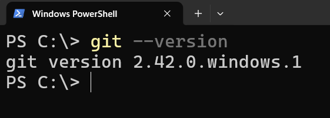

## Pembuatan Akun GitHub

1. Pilih `Sign Up` untuk mendaftarkan diri menjadi pengguna baru GitHub

   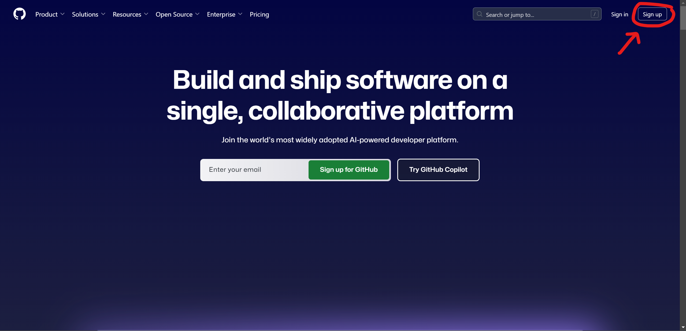

2. Isi semua data diri yang diperlukan untuk registrasi seperti email, password dan lain sebagainya

   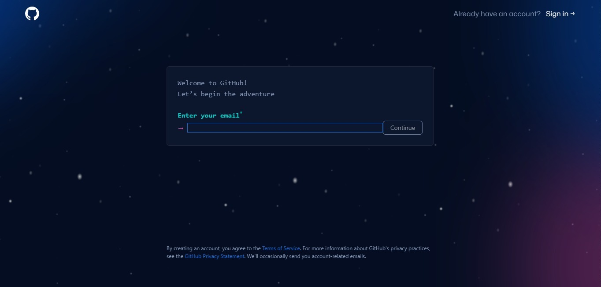

3. Selamat! Kamu telah berhasil membuat akun GitHub

> Kamu juga bisa melakukan personalisasi profil akun melalui [Settings](https://github.com/settings/profile)

## Text Editor

Text editor digunakan untuk melihat dan mengubah file kode selama pelatihan.
Pastikan Anda sudah memiliki text editor yang terinstall dan siap digunakan.

Disarankan menggunakan **Visual Studio Code (VS Code)**:
https://code.visualstudio.com/

Namun, peserta diperbolehkan menggunakan text editor lain sesuai dengan preferensi
masing-masing, selama nyaman dan dapat digunakan untuk menulis serta membaca kode.

## GitHub Desktop

> **Catatan Penting:**
> Instalasi dan autentikasi GitHub Desktop bersifat **opsional**, namun **sangat dianjurkan**
> untuk dilakukan sebelum pelatihan. GitHub Desktop **akan digunakan pada saat praktik
> materi**, sehingga peserta yang telah menyelesaikan langkah-langkah di bawah ini akan
> lebih mudah mengikuti sesi pelatihan tanpa hambatan teknis.

### Instalasi GitHub Desktop

1. Kunjungi laman utama dari [GitHub Desktop](https://github.com/apps/desktop), kemudian klik `Download Now`

   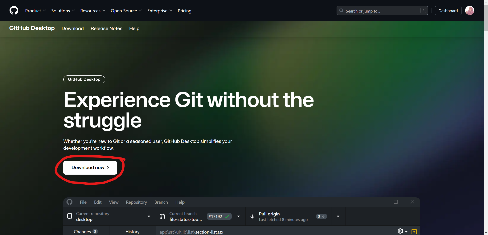

2. Klik `Download for Windows/MacOS`. Sesuaikan dengan sistem operasi yang kamu punya

   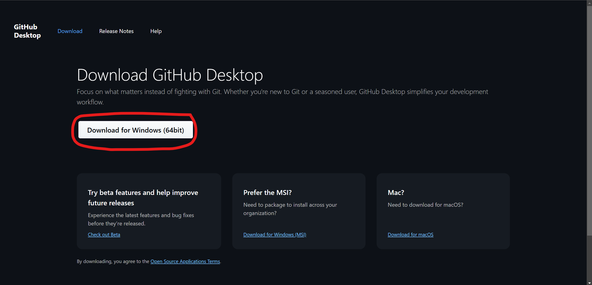

3. Klik dua kali pada setup file yang telah berhasil didownload.

   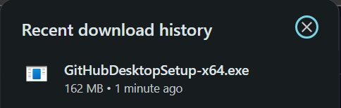

4. Setelah instalasi berhasil, GitHub Desktop akan otomatis terbuka. Tada! GitHub Desktop sudah tersedia di local Anda

   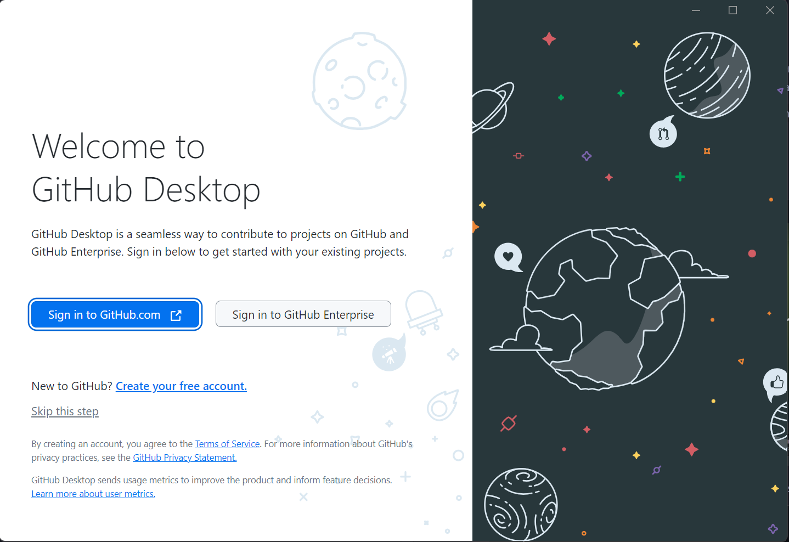

> Catatan: Kamu harus memiliki sistem operasi 64-bit agar bisa menjalankan GitHub Desktop

### Autentikasi GitHub Desktop

1. Buka GitHub Desktop, kemudian pilih `Sign in to GitHub.com`

   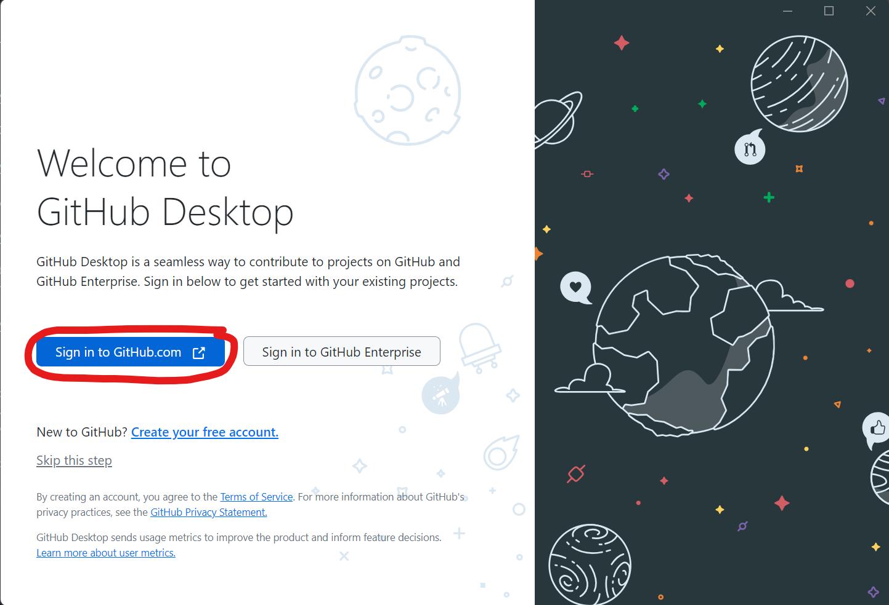

2. Kemudian Anda akan diarahkan ke halaman untuk memilih akun GitHub yang ingin dihubungkan ke GitHub Desktop

   

3. Setelah akun berhasil terhubung, Anda akan diminta untuk mengonfigurasi Git. Hal ini dilakukan agar Git dapat mengidentifikasi siapa pemilik commit yang telah dibuat. Terdapat dua opsi konfigurasi, yaitu menggunakan nama akun dari GitHub beserta alamat email nya atau konfigurasi secara manual.

   Pada kali ini, kita pilih opsi yang pertama, yaitu menggunakan nama akun dari GitHub beserta email yang terhubung. Kemudian sesuaikan alamat email yang kalian inginkan dan klik `Finish`.

   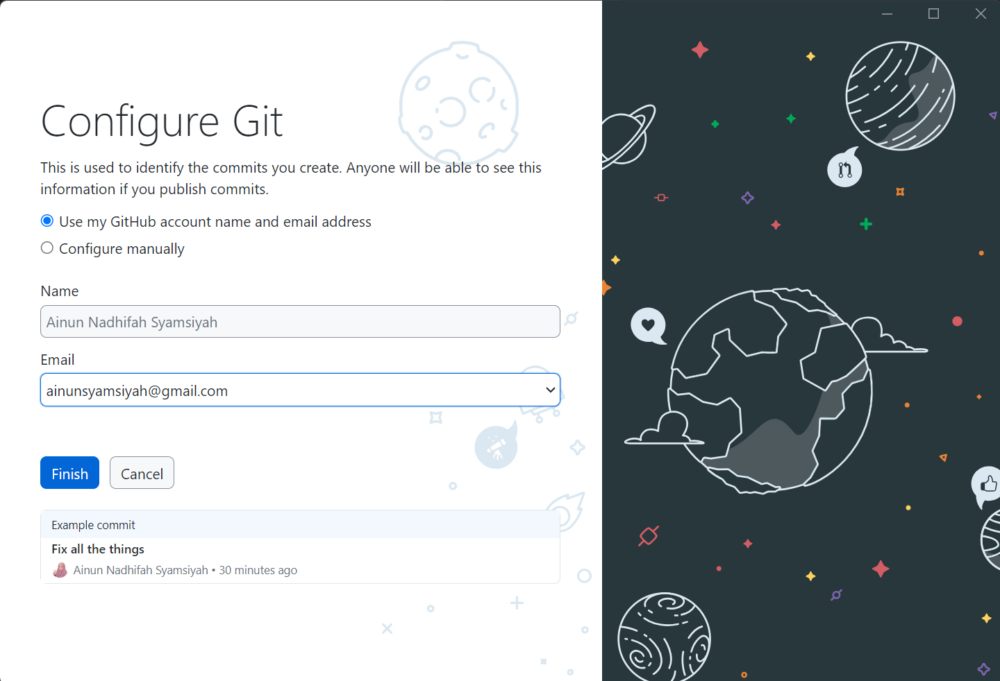

4. Selamat! GitHub Desktop Anda telah terautentikasi dengan akun GitHub

   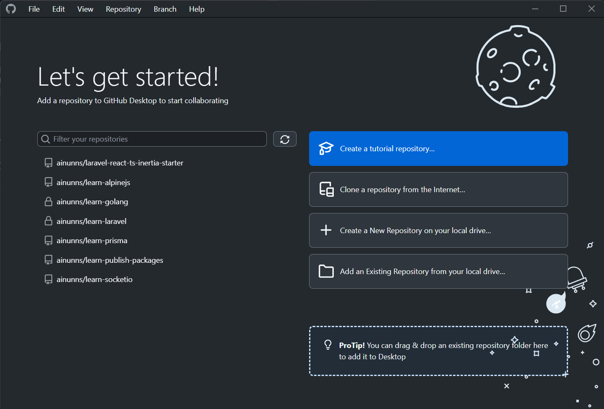

> Catatan: Anda dapat melakukan personalisasi GitHub Desktop lainnya dengan cara klik `File` > `Options` pada navigasi di atas
>
> 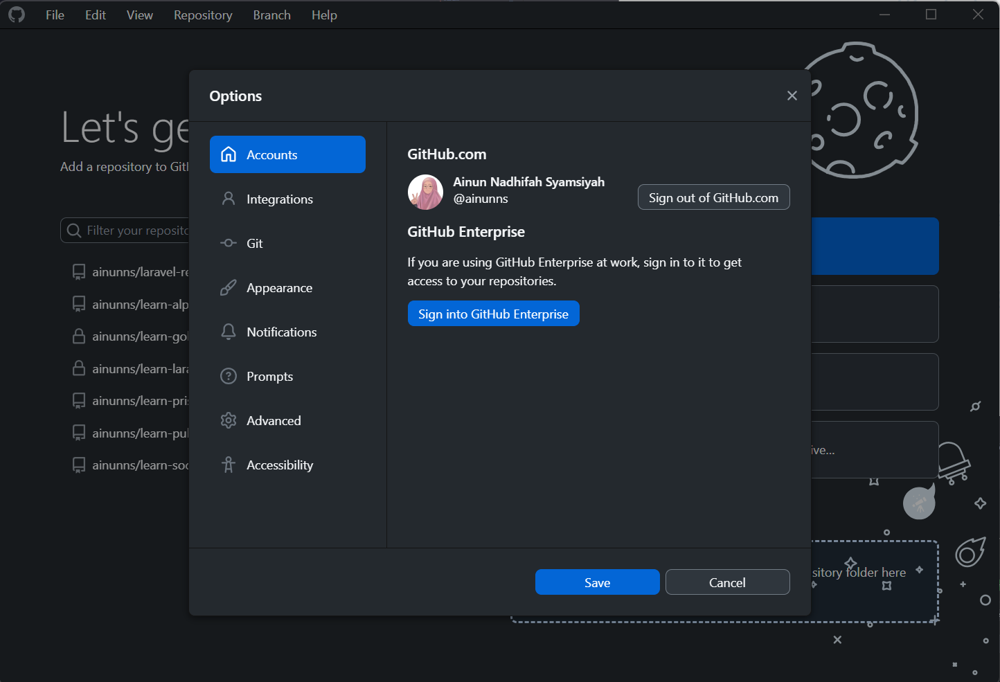

## Catatan Penting

Peserta yang belum menyelesaikan seluruh prerequisites di atas berisiko tertinggal saat sesi praktik.
Pastikan semua langkah telah dilakukan sebelum pelatihan dimulai.

> Apabila terdapat pertanyaan bisa langsung membuat pertanyaan pada: https://github.com/Lab-RPL-ITS/module-pelatihan-vcs/discussions
