# Berkolaborasi dengan GitHub

Bab ini dirancang untuk memperkenalkan peserta pada cara-cara praktis berkolaborasi menggunakan GitHub. Dengan pendekatan hands-on, peserta akan langsung mempraktikkan langkah-langkah yang dijelaskan sambil didampingi pemateri. Setiap tugas akan memperkuat pemahaman peserta terhadap konsep yang diajarkan.

## Fork

Fork adalah cara untuk berkontribusi pada sebuah repository yang dimiliki oleh orang lain. Dengan melakukan fork, kita akan memiliki repository yang sama persis dengan repository orang lain. Perubahan yang dilakukan pada repository hasil fork tidak akan mempengaruhi repository aslinya.

Untuk melakukan fork, kita dapat menggunakan tombol fork yang ada pada repository orang lain.


Setelah melakukan fork, kita akan memiliki repository yang sama persis dengan repository orang lain. Repository tersebut akan berada pada akun kita.

### Issue

Issue digunakan untuk melacak tugas, perbaikan, atau diskusi pada repository. Issue dapat digunakan untuk berkolaborasi dengan orang lain pada repository.

Didalam issue, kita dapat memberikan label, assignee, dan milestone. Label digunakan untuk memberikan kategori pada issue. Assignee digunakan untuk menunjuk orang yang bertanggung jawab pada issue. Milestone digunakan untuk memberikan target waktu pada issue.

### Contribute

Untuk melakukan contribusi antara repository yang ada pada akun kita dengan repository aslinya, kita dapat melakukan pull request. Untuk melakukan pull request, kita dapat menggunakan tombol contribute yang ada pada repository hasil fork. Setelah itu, kita dapat memilih open pull request.


- Case diatas kita belum melakukan perubahan apapun pada repository hasil fork.

### Sync Fork

Sedangkan untuk melakukan sinkronisasi antara repository hasil fork dengan repository aslinya, kita dapat menggunakan tombol sync yang ada pada repository hasil fork. Setelah itu, kita dapat memilih fetch upstream.


Dan kita dapat menekan tombol update branch untuk melakukan sinkronisasi.

### Langkah-langkah Forking

Akses Repository: Buka repository di GitHub yang ingin Anda fork. Contoh, pemateri menyediakan link ke repository demo-repository.
Klik Tombol Fork: Tombol ini terletak di bagian kanan atas halaman repository.
Konfirmasi Forking: Setelah klik, GitHub akan membuat salinan repository tersebut di akun Anda. Repository hasil fork dapat ditemukan di daftar repository.

### Task 1: Fork Repository

Instruksi: Fork repository yang telah disediakan oleh pemateri. Pastikan repository tersebut muncul di akun Anda.
Tujuan: Memastikan peserta memahami cara fork dan menemukan repository di akun mereka.

Membuat Perubahan di Fork Anda
Setelah fork selesai, Anda dapat memodifikasi file di repository Anda. Perubahan ini tidak akan memengaruhi repository asli. Misalnya, tambahkan nama Anda ke file README.md.

### Task 2: Edit dan Pull Request

Edit File: Buka file README.md di repository hasil fork dan copy file readme dan rename dengan nama Anda.

1. Buat File: Buat file `<nama anda>`.md di repository hasil fork dan tambahkan nama Anda ke dalam daftar kontributor.

- Contoh isi file sebelum perubahan:

```markdown
# Daftar Kontributor

- Alice
- Bob
```

- Setelah diedit:

```markdown
# Daftar Kontributor

- Alice
- Bob
- [Nama Anda]
```

2. Commit dan Push: Simpan perubahan dan commit melalui GitHub.

3. Buat Pull Request:
   Klik tombol Pull Request pada repository fork.
   Berikan judul deskriptif, misalnya, "Add my name to contributors".
   Kirim permintaan ke repository asli.

> Pull request adalah cara untuk berkontribusi pada repository orang lain. Pull request memungkinkan pemilik repository asli untuk meninjau perubahan yang Anda buat dan menggabungkannya ke repository asli.

## Sinkronisasi Repository Fork dengan Repository Asli

Ketika repository asli diperbarui, fork Anda bisa menjadi usang. Fitur Sync Fork digunakan untuk memperbarui repository fork agar selaras dengan repository asli.

### Langkah-Langkah Sync Fork

1. Buka repository hasil fork.
2. Klik tombol Fetch upstream di GitHub.
3. Pilih Sync fork dan klik Update branch untuk menggabungkan perubahan dari repository asli.

### Task 3: Sinkronkan Repository Fork

1. Pemateri akan memperbarui repository asli dengan file baru.
2. Peserta diminta melakukan sinkronisasi pada fork mereka untuk mendapatkan file baru tersebut.

## Cloning Repository untuk Kolaborasi Lokal

Cloning digunakan untuk bekerja secara lokal pada repository, terutama jika Anda memiliki akses kontribusi langsung.

### Langkah Cloning

1. Klik tombol Code di halaman repository GitHub.
2. Salin URL repository.
3. Di terminal, jalankan perintah:

```
git clone <URL-repository>
```

4. Buka folder repository yang di-clone dan mulai bekerja.

### Task 4: Clone dan Modifikasi File

1. Clone repository demo-pelatihan-vsc-rpl-2024 setelah di fork ke komputer Anda.
2. Tambahkan file baru, misalnya, new-feature.txt, lalu isi dengan teks:

```
Fitur baru dari [Nama Anda]
```

3. Commit perubahan dan push ke repository asli.

```bash
git add new-feature.txt
git commit -m "Add new feature"
git push
```

## Conflict

Conflict terjadi ketika terdapat perubahan yang dilakukan pada baris yang sama pada file yang sama. Conflict dapat terjadi ketika kita melakukan merge atau pull request.

Langsung saja kita simulasikan conflict.

### Contoh Conflict Sederhana

1. Misalkan terdapat sebuah file `greetings.txt` pada branch `main` dengan isi sebagai berikut:

   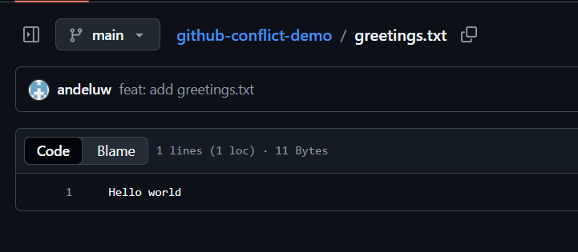

2. Selanjutnya, Alice dan Bob ditugaskan untuk mengubah file `greetings.txt` dengan menambahkan nama masing-masing. Untuk itu, mereka membuat branch mereka sendiri dan melakukan perubahan pada file yang sama, yaitu `greetings.txt`.

3. Alice melakukan perubahan pada branch miliknya dengan menambahkan namanya ke dalam file.

   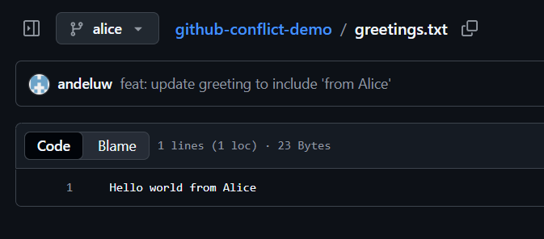

4. Bob juga melakukan perubahan pada file yang sama di branch miliknya dengan menambahkan namanya.

   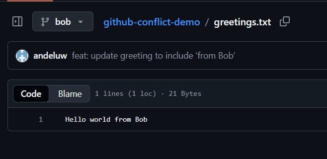

5. Setelah selesai, Alice berencana untuk menggabungkan hasil pekerjaannya ke branch main. Oleh karena itu, ia terlebih dahulu melakukan merge branch `alice` ke `main`.

   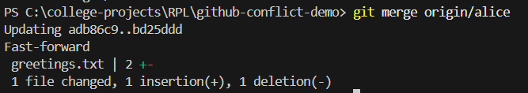

   Setelah proses merge selesai, file `greetings.txt` pada branch `main` telah menyertakan perubahan dari Alice.

   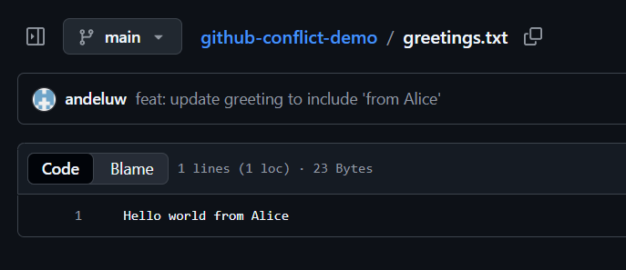

6. Selanjutnya, Alice mencoba melakukan merge branch `bob` ke branch `main`. Namun, pada tahap ini terjadi conflict. Hal ini disebabkan karena branch `alice` dan branch `bob` sama-sama mengubah baris yang sama pada file `greetings.txt`. Git tidak dapat menentukan perubahan mana yang harus dipertahankan secara otomatis.

   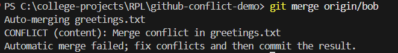

   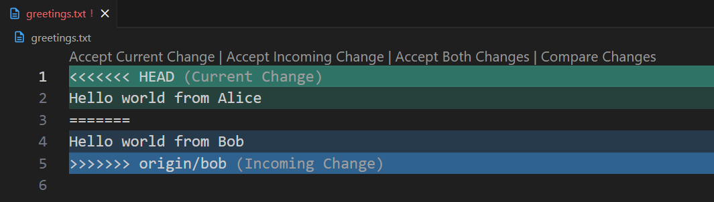

7. Untuk menyelesaikan conflict tersebut, Alice memilih opsi `Resolve in Merge Editor`.

   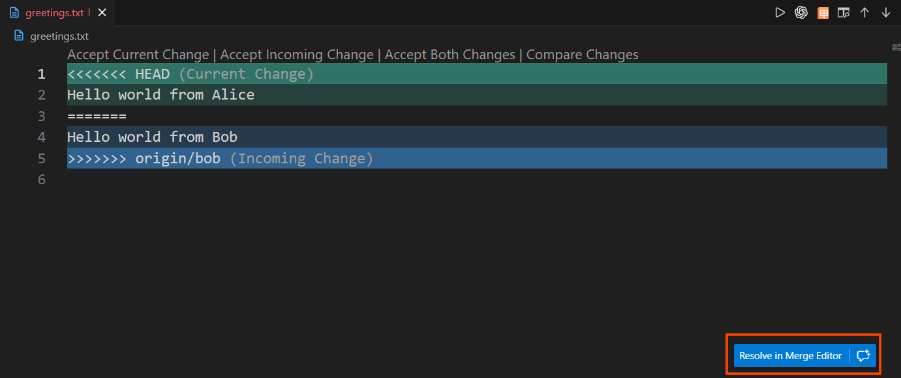

8. Pada Merge Editor, Alice diberikan beberapa pilihan untuk menyelesaikan conflict, antara lain:

- Accept Current Change, yaitu menerima perubahan dari branch alice
- Accept Incoming Change, yaitu menerima perubahan dari branch bob
- Menyelesaikan conflict secara manual (manual resolution) dengan mengedit baris kode secara langsung

  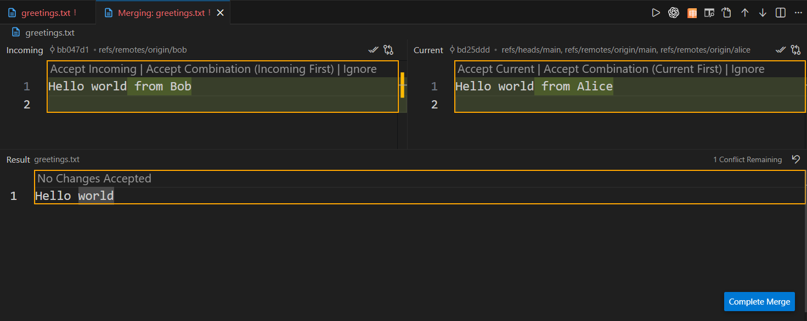

9. Pada simulasi ini, Alice memilih untuk menyelesaikan conflict secara manual dengan menggabungkan perubahan dari kedua branch. Setelah selesai, Alice menekan tombol `Complete Merge`.

   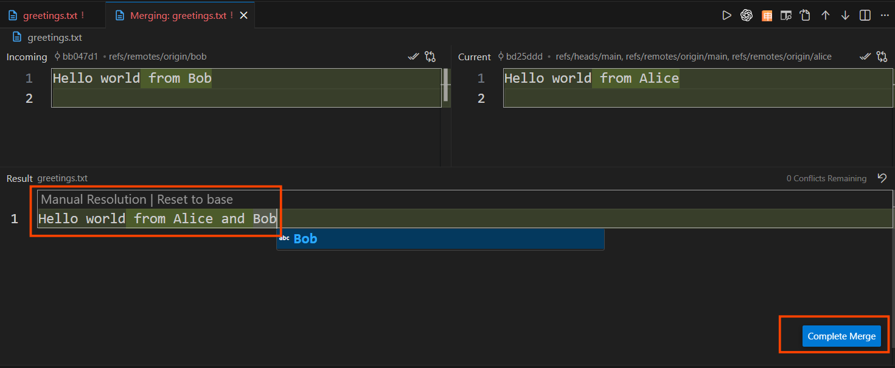

10. Setelah conflict berhasil diselesaikan, Alice melakukan commit dan push untuk menyimpan hasil merge tersebut ke repository.

    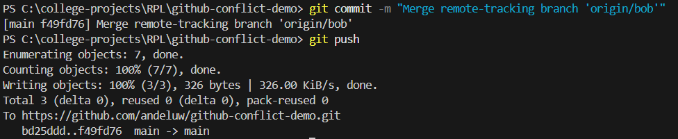

11. Selamat! Sekarang perubahan dari kedua branch telah berhasil digabungkan, dan hasil resolve conflict dapat dilihat pada repository.

    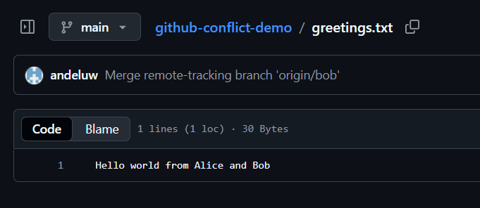

## Rebase Vs Merge Vs Squash

Rebase, merge, dan squash adalah tiga cara untuk menggabungkan perubahan dari satu branch ke branch lain, biasanya ke branch utama (`main`).
Masing-masing memiliki tujuan dan konsekuensi yang berbeda terhadap history commit.

## Rebase

**Rebase** adalah teknik untuk menggabungkan perubahan dengan cara “memindahkan” commit dari satu branch ke atas commit terbaru dari branch lain. Bayangkan seperti memotong cabang pohon dan menempelkannya kembali di tempat yang berbeda—hasilnya lebih rapi dan linear!

**Perbedaan utama dengan merge**: Rebase **mengubah sejarah commit** sehingga timeline menjadi lebih bersih dan mudah dibaca, seolah-olah perubahan Anda dibuat setelah perubahan di branch lain.

**Kapan menggunakan rebase?**

- Saat ingin history commit yang rapi dan linear
- Sebelum merge ke branch utama (untuk "membersihkan" commits)
- Saat bekerja di feature branch pribadi

⚠️ **Peringatan**: Jangan rebase pada branch yang sudah di-push dan digunakan orang lain, karena dapat menyebabkan konflik history!

#### Menggunakan GitHub Desktop

1. Checkout ke branch yang ingin di-rebase
2. Klik menu `Branch` → `Rebase Current Branch`
3. Pilih branch target (biasanya `main`)
4. Klik `Start Rebase`
5. Selesaikan konflik jika ada, lalu klik `Continue Rebase`

#### Menggunakan Command Line

**Langkah-langkah rebase:**

1. **Checkout ke branch yang ingin di-rebase**

```bash
   git checkout feature-branch
```

2. **Lakukan rebase dengan branch target**

```bash
   git rebase main
```

Ini akan mengambil semua commit di `feature-branch` dan "memutar ulang" di atas commit terakhir dari `main`.

3. **Jika ada konflik, selesaikan konflik**
   - Edit file yang konflik
   - Stage perubahan:

```bash
     git add .
```

- Lanjutkan rebase:

```bash
     git rebase --continue
```

4. **Jika ingin membatalkan rebase**

```bash
   git rebase --abort
```

**Contoh lengkap:**

```bash
git checkout feature-login
git rebase main
# Selesaikan konflik jika ada
git add .
git rebase --continue
```

---

## Merge

**Merge** adalah cara klasik untuk menggabungkan perubahan dari satu branch ke branch lain. Berbeda dengan rebase, merge **mempertahankan sejarah commit** apa adanya dan membuat commit baru khusus untuk penggabungan (merge commit).

**Perbedaan utama dengan rebase**: Merge **tidak mengubah sejarah commit**, sehingga lebih aman untuk branch yang sudah dipublikasikan dan digunakan bersama.

**Kapan menggunakan merge?**

- Saat menggabungkan feature branch ke branch utama
- Saat bekerja kolaboratif di branch yang sama
- Saat ingin mempertahankan konteks lengkap dari development

#### Menggunakan GitHub Desktop

1. Checkout ke branch tujuan (misal `main`)
2. Klik menu `Branch` → `Merge into Current Branch`
3. Pilih branch yang ingin digabungkan
4. Klik `Merge`
5. Selesaikan konflik jika ada

#### Menggunakan Command Line

**Langkah-langkah merge:**

1. **Checkout ke branch tujuan**

```bash
   git checkout main
```

2. **Merge branch yang diinginkan**

```bash
   git merge feature-branch
```

Git akan membuat merge commit baru yang menggabungkan kedua branch.

3. **Jika ada konflik, selesaikan konflik**
   - Edit file yang konflik
   - Stage perubahan:

```bash
     git add .
```

- Lanjutkan merge dengan commit:

```bash
     git commit -m "Merge feature-branch into main"
```

4. **Jika ingin membatalkan merge**

```bash
   git merge --abort
```

---

## Squash

**Squash** adalah teknik untuk menggabungkan beberapa commit menjadi satu commit yang lebih ringkas dan bermakna. Bayangkan Anda punya 10 commit kecil seperti "fix typo", "oops forgot this", "final fix I promise"—squash mengubahnya jadi 1 commit profesional: "Add user authentication feature". Much cleaner! ✨

**Kenapa perlu squash?**

- Membuat history lebih bersih dan mudah dibaca
- Menghilangkan commit "sampah" seperti "WIP" atau "fix typo"
- Lebih profesional saat merge ke branch utama

**Kapan menggunakan squash?**

- Sebelum merge feature branch ke main
- Saat punya banyak small commits yang sebenernya satu fitur
- Saat ingin "merapikan" history sebelum pull request

#### Menggunakan GitHub Desktop

1. Saat akan merge, pilih opsi `Squash and Merge`
2. GitHub Desktop akan menggabungkan semua commit dari branch menjadi satu
3. Edit pesan commit gabungan
4. Klik `Squash and Merge`

#### Menggunakan Command Line

**Metode 1: Interactive Rebase (Recommended)**

1. **Tentukan berapa commit yang ingin di-squash**

```bash
   git log --oneline
```

Lihat berapa commit terakhir yang ingin digabungkan (misal 3 commit).

2. **Mulai interactive rebase**

````bash
   git rebase -i HEAD~3
```
   - `HEAD~3` berarti 3 commit terakhir
   - Editor akan terbuka dengan daftar commit

3. **Edit instruksi rebase**
   Ubah kata `pick` menjadi `squash` (atau `s`) untuk commit yang ingin digabungkan:
```
   pick abc1234 Add login form
   squash def5678 Fix validation bug
   squash ghi9012 Update styling
````

Simpan dan tutup editor.

4. **Edit pesan commit gabungan** Editor akan terbuka lagi untuk mengedit pesan commit hasil squash. Tulis pesan yang bermakna, misal: "Add complete login feature"
5. **Push hasil squash** (jika sudah pernah push sebelumnya)

```bash
   git push --force-with-lease origin feature-branch
```

**Metode 2: Squash saat Merge**

bash

```bash
git checkout main
git merge --squash feature-branch
git commit -m "Add complete login feature"
git push origin main
```

**Contoh lengkap:**

bash

```bash
# Lihat commit history
git log --oneline

# Squash 5 commit terakhir
git rebase -i HEAD~5

# Dalam editor, ubah:
# pick → squash untuk commit yang mau digabung

# Edit pesan commit final
# Save & close

# Push dengan force
git push --force-with-lease origin feature-login
```

> ⚠️ **Warning**: Squash mengubah history, jadi gunakan `--force-with-lease` saat push. Jangan squash commit yang sudah digunakan orang lain!

> 💡 **Pro Tip**: Gunakan `fixup` (atau `f`) instead of `squash` jika ingin langsung buang pesan commit lama tanpa edit manual!
